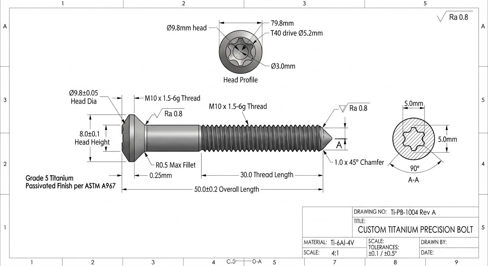

Cuando un envase estándar no se ajusta a la unión, fabricamos la fijación según su especificación: formas de cabeza no estándar, longitudes exactas a medida, dimensiones de hombro específicas o un laminado de roscas especializado. Las piezas se tornean con precisión por CNC o se forjan en frío, desde prototipos hasta producción en serie.

## Qué se puede personalizar

### Tipos de cabeza

- Tornillo de cabeza cilíndrica Allen
- Tornillo de cabeza abombada
- Tornillo de cabeza avellanada
- Tornillo de cabeza hexagonal con brida
- Tornillo de hombro de precisión
- Pieza torneada a medida según su plano

Las versiones estándar de estas cabezas están en el catálogo: [tornillos de cabeza cilíndrica Allen](/es/collections/tornillos-de-cabeza-cilindrica-allen), [tornillos de cabeza abombada](/es/collections/tornillos-de-cabeza-abombada), [tornillos de cabeza avellanada](/es/collections/tornillos-de-cabeza-avellanada), [tornillos de cabeza hexagonal](/es/collections/tornillos-de-cabeza-hexagonal) y [tornillos de hombro](/es/collections/tornillos-de-hombro).

### Medidas de rosca

- M3 × 0,5
- M4 × 0,7
- M5 × 0,8
- M6 × 1,0
- M8 × 1,25
- M10 × 1,5
- Cualquier otra dimensión, descrita en su solicitud

### Longitudes de rosca y de hombro

- 10 mm
- 12 mm
- 16 mm
- 20 mm
- 25 mm
- 30 mm
- 40 mm
- 50 mm
- Cualquier otra longitud específica, descrita en su solicitud

### Tipos de accionamiento

- Hexágono interior (estándar)
- Accionamiento Torx (alto par)
- Combinado Phillips y ranura
- Brida de 12 puntas (calidad aeroespacial)
- Hueco de seguridad tipo spanner
- Sin accionamiento (pieza torneada lisa)

### Venteo

- Orificio central de venteo para el alivio de vacío: un centro hueco taladrado a través de la cabeza para aliviar la presión en entornos de vacío

### Materiales

- Titanio grado 5 (Ti-6Al-4V), para la máxima resistencia
- Titanio grado 2 (comercialmente puro), para una resistencia a la corrosión superior
- Aleación de titanio con paladio grado 7
- Aleación aeroespacial especial a medida

La [guía de materiales](/es/guia-de-materiales) recoge la composición y las propiedades de cada grado de titanio, incluido el grado 23 (Ti-6Al-4V ELI). Indique en su solicitud el grado que necesita.

## Tolerancias

- **Tolerancia de torneado CNC:** hasta ±0,01 mm en las dimensiones.
- **Capacidad de forja en frío:** producción en serie de tornillos Allen y pernos de alta resistencia.
- **Precisión de la rosca:** perfil de rosca estándar ISO clase 6g.

## Ensayos

- **Los ensayos no destructivos por ultrasonidos** detectan defectos estructurales subsuperficiales en componentes aeroespaciales a medida.
- **Comportamiento ante esfuerzos mecánicos:** los ensayos de tracción están disponibles a petición.

El proceso de inspección completo y los certificados que emitimos se describen en [aseguramiento de la calidad](/es/aseguramiento-de-calidad).

## Cómo se tramita una solicitud

1. Envíe la solicitud con el formulario de más abajo. El formulario de este sitio solo admite texto.
2. Un ingeniero revisa la solicitud y responde por correo electrónico en un plazo de 2 a 4 horas laborables.
3. Envíe su plano por correo electrónico de respuesta, como archivo PDF técnico, DXF, IGS o STEP. Los planos siempre viajan así, tras el primer contacto, porque el formulario no admite archivos.
4. Nuestro equipo sénior de ingeniería revisa el plano y la especificación, y enviamos una oferta de precios formal.
5. Ambas partes dan su conformidad al plano. Un plano a medida aprobado prevalece sobre las especificaciones estándar del catálogo.
6. Una oferta es vinculante durante 30 días naturales, salvo que los recargos del mercado de metales sobre los tochos fluctúen más de un 10 %, y un pedido pasa a ser vinculante tras la confirmación por escrito de nuestro equipo de ingeniería. Los [términos y condiciones](/es/terminos-y-condiciones) recogen los detalles.

Cada plano que recibimos se trata como propiedad intelectual reservada bajo un acuerdo de confidencialidad mutuo (NDA) automático: consulte la [política de privacidad](/es/privacidad).

## Qué enviar

En la solicitud, describa la pieza con palabras:

- el tipo de cabeza, el tipo de accionamiento y si se necesita un orificio central de venteo;
- la medida nominal y el paso de la rosca;
- la longitud de la rosca o del hombro;
- el grado del material;
- los ángulos de chaflán requeridos y los marcados particulares de la cabeza;
- el nivel de certificación del material, por ejemplo EN 10204 3.1;
- cualquier tolerancia particular;
- la aplicación: temperatura de funcionamiento prevista, parámetros de carga de cizalladura y volumen previsto.

Después, por correo electrónico de respuesta, el plano técnico o el archivo CAD.

## Solicite una oferta a medida

Díganos qué es lo que el catálogo estándar no cubre. Su solicitud llega a nuestros especialistas en mecanizado de titanio.

[[inquiry]]
